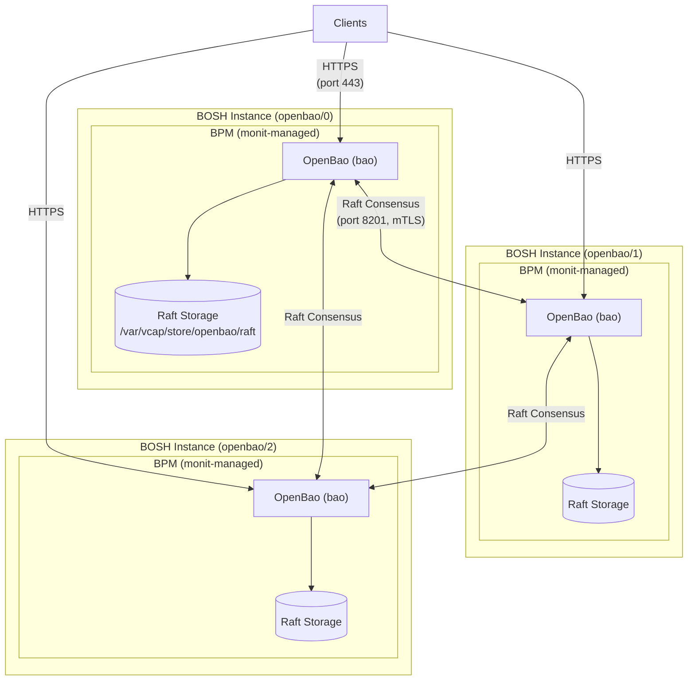

# OpenBao BOSH Release

A BOSH release for [OpenBao](https://github.com/openbao/openbao) v2.5.1 — an open-source secrets management solution forked from HashiCorp Vault.

## Overview

This release deploys OpenBao with Raft integrated storage, replacing the Consul-backed architecture used by the safe (Vault) BOSH release. It supports both standalone (1 instance) and HA cluster (3+ instances) deployments via BOSH links for automatic Raft peer discovery.

## Key Features

- **Raft integrated storage** — no separate Consul cluster required

- **BPM process management** — with IPC_LOCK capability for mlock support

- **Automatic TLS** — operator-provided certificates primary, self-signed fallback via certifier

- **BOSH link-based clustering** — automatic Raft peer discovery from instance group

## Deployment

### HA Cluster (3 instances, recommended)

```bash
bosh -d openbao deploy manifests/openbao.yml
```

### Standalone (1 instance)

```bash
bosh -d openbao deploy manifests/openbao.yml \
  -o manifests/ops/standalone.yml
```

## Properties

| Property | Default | Description |
|----------|---------|-------------|
| `openbao.port` | `443` | TCP port to bind OpenBao on |
| `openbao.ui` | `false` | Enable the OpenBao web UI |
| `openbao.log_level` | `info` | Log level (trace, debug, info, warn, error) |
| `openbao.default_lease_ttl` | `768h` | Default lease TTL |
| `openbao.max_lease_ttl` | `768h` | Maximum lease TTL |
| `openbao.tls.certificate` | — | TLS certificate for client communication |
| `openbao.tls.key` | — | TLS private key for client communication |
| `openbao.peer.tls.ca` | — | TLS CA for Raft peer verification |
| `openbao.peer.tls.certificate` | — | TLS certificate for Raft peer communication |
| `openbao.peer.tls.key` | — | TLS private key for Raft peer communication |
| `openbao.peer.tls.verify` | `true` | Verify Raft peer TLS certificates |
| `openbao.peer.tls.use_self_signed_certs` | `false` | Use self-signed peer certificates |

## Post-Deployment

After initial deployment, initialize and unseal OpenBao:

```bash
# Initialize
bosh -d openbao ssh openbao/0 -c \
  '/var/vcap/packages/openbao/bin/bao operator init'

# Unseal (repeat with required number of keys on each instance)
bosh -d openbao ssh openbao/0 -c \
  '/var/vcap/packages/openbao/bin/bao operator unseal'

# Verify Raft peers (after unseal)
bosh -d openbao ssh openbao/0 -c \
  '/var/vcap/packages/openbao/bin/bao operator raft list-peers'
```

## Architecture



## Packages

| Package | Contents |
|---------|----------|
| `openbao` | `bao` binary + `canimlock` mlock checker |
| `certifier` | Self-signed TLS certificate generator |

## Differences from safe Release

| safe (Vault) | openbao | Notes |
|---|---|---|
| Consul storage backend | Raft integrated storage | No external dependency |
| vault binary | bao binary | Drop-in replacement |
| consul + strongbox processes | Single bao process | Raft handles consensus |
| Raw monit scripts | BPM process management | Modern BOSH pattern |
| 3 monit processes | 1 BPM process | Simpler operations |
