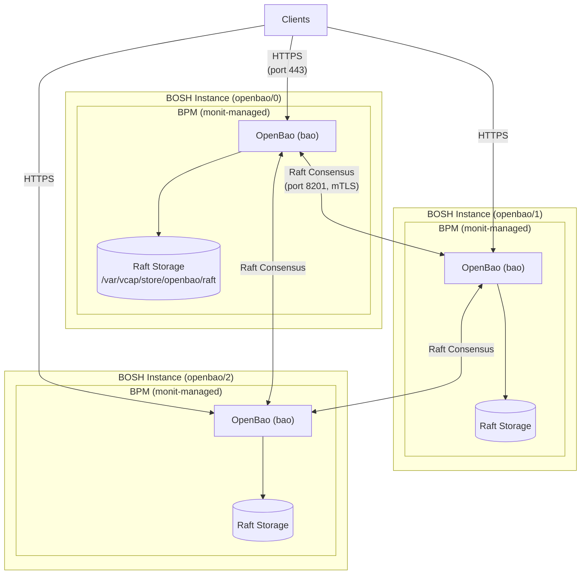

# OpenBao BOSH Release

A BOSH release for [OpenBao](https://github.com/openbao/openbao) v2.7.1 — an open-source secrets management solution forked from HashiCorp Vault.

## Overview

This release deploys OpenBao with Raft integrated storage, replacing the Consul-backed architecture used by the safe (Vault) BOSH release. It supports both standalone (1 instance) and HA cluster (3+ instances) deployments via BOSH links for automatic Raft peer discovery.

## Key Features

- **Raft integrated storage** — no separate Consul cluster required

- **BPM process management** — with IPC_LOCK capability for mlock support

- **Automatic TLS** — operator-provided certificates primary, self-signed fallback via certifier

- **BOSH link-based clustering** — automatic Raft peer discovery from instance group

## Deployment

### HA Cluster (3 instances, recommended)

```bash
bosh -d openbao deploy manifests/openbao.yml
```

### Standalone (1 instance)

```bash
bosh -d openbao deploy manifests/openbao.yml \
  -o manifests/ops/standalone.yml
```

## Properties

| Property | Default | Description |
|----------|---------|-------------|
| `openbao.port` | `443` | TCP port to bind OpenBao on |
| `openbao.ui` | `false` | Enable the OpenBao web UI |
| `openbao.log_level` | `info` | Log level (trace, debug, info, warn, error) |
| `openbao.default_lease_ttl` | `768h` | Default lease TTL |
| `openbao.max_lease_ttl` | `768h` | Maximum lease TTL |
| `openbao.disable_standby_reads` | `true` | Forward reads on standby nodes to the active node, so every read sees the write before it (OpenBao's own default is `false`) |
| `openbao.seal.type` | `static` | How OpenBao unseals, either `static` (automatic, from a key file) or `shamir` (manual). Static fails the render when no key is given |
| `openbao.seal.static.current_key` | — | Static seal key as 64 hex characters or 44 base64 characters that decode to 32 bytes |
| `openbao.seal.static.current_key_id` | derived | Key id, which defaults to `sha256-` plus the first 16 hex characters of the SHA-256 of the key bytes |
| `openbao.seal.static.previous_key` | — | Previous key, set only during rotation together with its id |
| `openbao.seal.static.previous_key_id` | — | Id of the previous key |
| `openbao.seal.static.disabled` | `false` | Renders `disabled = "true"`, which migrates the cluster from static back to Shamir |
| `openbao.tls.certificate` | — | TLS certificate for client communication |
| `openbao.tls.key` | — | TLS private key for client communication |
| `openbao.peer.tls.ca` | — | TLS CA for Raft peer verification |
| `openbao.peer.tls.certificate` | — | TLS certificate for Raft peer communication |
| `openbao.peer.tls.key` | — | TLS private key for Raft peer communication |
| `openbao.peer.tls.verify` | `true` | Verify Raft peer TLS certificates |
| `openbao.peer.tls.use_self_signed_certs` | `false` | Use self-signed peer certificates |

## Post-Deployment

After initial deployment, initialize and unseal OpenBao:

```bash
# Initialize
bosh -d openbao ssh openbao/0 -c \
  '/var/vcap/packages/openbao/bin/bao operator init'

# Unseal (repeat with required number of keys on each instance)
bosh -d openbao ssh openbao/0 -c \
  '/var/vcap/packages/openbao/bin/bao operator unseal'

# Verify Raft peers (after unseal)
bosh -d openbao ssh openbao/0 -c \
  '/var/vcap/packages/openbao/bin/bao operator raft list-peers'
```

## Upgrading to 0.4.0

This release adds a static seal, and it makes `static` the default seal type. A static seal means OpenBao unseals itself from a key file at every start, so a reboot no longer needs anyone to type Shamir shares. The release fails closed, which means the render stops with an error when the type is `static` and no key is given. Nothing can turn an existing cluster into a static one by accident.

Every existing Shamir deployment has to add one line before it upgrades, which is `openbao.seal.type: shamir`. With that line the job renders no seal stanza and behaves exactly as it did in 0.3.5. While the type is `shamir`, setting any `openbao.seal.static.*` property fails the render, so a stray key cannot slip in.

Before we choose static, we should be honest about the trade. The key sits on the same VM as the data it protects, so anyone with root on the instance, or with a copy of its disk or backup, has both the ciphertext and the key. Shamir needed several people to cooperate, and a static seal does not.

### Migrating from Shamir to static

Let's generate a key that is 64 hex characters, for example with `openssl rand -hex 32`, and store it somewhere safe before we use it. If we lose the key, the data cannot be recovered, because recovery keys cannot decrypt it. We then set `openbao.seal.type: static` and `openbao.seal.static.current_key` and deploy. The release writes the key to `/var/vcap/jobs/openbao/seal/current.key`, and the job comes up sealed with a seal migration pending, because the stored barrier is still a Shamir one.

Now we run the unseal command once on each instance with the `-migrate` flag, providing the existing Shamir shares until the threshold is met. The logs show `seal migration initiated` and then `seal migration complete`. From that point the node unseals itself on every start, and the old Shamir shares are no longer used for unsealing.

### Rotating the static key

To rotate, we generate a new key and deploy with the new key as `current_key` and the old one as `previous_key`, along with `previous_key_id`. The previous id is the one the old key had, which is `sha256-` and the first 16 hex characters of its hash unless we set an id by hand. After the deploy, OpenBao re-wraps its stored keys under the new key at the next unseal, and the log should show no `post-unseal upgrade seal keys failed` warning. Once that is confirmed on every instance, we remove `previous_key` and `previous_key_id` and deploy again.

The release refuses a rotation where the previous and current keys are the same bytes under different ids, or different bytes under the same id, because OpenBao would reject that at unseal time.

### Going back to Shamir

To return to manual unsealing, we first deploy with `openbao.seal.static.disabled: true` and leave the type and key in place. This renders `disabled = "true"` in the static stanza. Then we run the unseal command with `-migrate` on each instance, using the original Shamir shares, until the logs show `seal migration complete`. Only after that do we set `openbao.seal.type: shamir`, remove every `openbao.seal.static.*` property, and deploy again.

## Upgrading to 0.3.4

This release moves OpenBao from 2.6.1 to 2.7.0 and forwards reads on standby nodes to the active node by default. Please keep three things in mind before rolling it out.

- Removed engines
  OpenBao 2.7.0 no longer builds in the LDAP, Kerberos, and RADIUS auth methods or the LDAP secrets engine. Before upgrading, run `bao auth list` and `bao secrets list` against each cluster and make sure none of them is mounted, because a node with a mount whose plugin is missing can fail to unseal.

- Outage window
  With Shamir seals, every node that BOSH restarts comes back sealed, so a rolling update of a three-node cluster loses quorum once the second node restarts. The cluster stays down until every node is unsealed again.

- Unsealing with forwarded reads
  With `disable_standby_reads` true, a single unsealed node cannot answer any authenticated request until a second node is unsealed and a leader is elected. Unseal every node with keys you already hold rather than reading the stored keys back through the first unsealed node.

## Architecture


```mermaid
graph TD
    subgraph instance1["BOSH Instance (openbao/0)"]
        subgraph bpm1["BPM (monit-managed)"]
            bao1["OpenBao (bao)"]
            raft1[("Raft Storage<br/>/var/vcap/store/openbao/raft")]
            bao1 --> raft1
        end
    end

    subgraph instance2["BOSH Instance (openbao/1)"]
        subgraph bpm2["BPM (monit-managed)"]
            bao2["OpenBao (bao)"]
            raft2[("Raft Storage")]
            bao2 --> raft2
        end
    end

    subgraph instance3["BOSH Instance (openbao/2)"]
        subgraph bpm3["BPM (monit-managed)"]
            bao3["OpenBao (bao)"]
            raft3[("Raft Storage")]
            bao3 --> raft3
        end
    end

    bao1 <-- "Raft Consensus<br/>(port 8201, mTLS)" --> bao2
    bao2 <-- "Raft Consensus" --> bao3
    bao1 <-- "Raft Consensus" --> bao3

    clients["Clients"] -- "HTTPS<br/>(port 443)" --> bao1
    clients -- "HTTPS" --> bao2
    clients -- "HTTPS" --> bao3
```

## Packages

| Package | Contents |
|---------|----------|
| `openbao` | `bao` binary + `canimlock` mlock checker |
| `certifier` | Self-signed TLS certificate generator |

## Differences from safe Release

| safe (Vault) | openbao | Notes |
|---|---|---|
| Consul storage backend | Raft integrated storage | No external dependency |
| vault binary | bao binary | Drop-in replacement |
| consul + strongbox processes | Single bao process | Raft handles consensus |
| Raw monit scripts | BPM process management | Modern BOSH pattern |
| 3 monit processes | 1 BPM process | Simpler operations |
